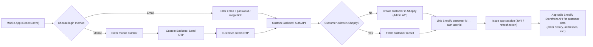

# E-Commerce Platform Proposal - Pharmacy App

## Overview

Proposal for rebuilding the pharmacy e-commerce **mobile app** and improving the existing platform for the client. The website is already live and hosted on **Hostinger**, and **Shopify is already configured** in production.

Our approach: **Shopify as the sole backend** (inventory, orders, products, payments via Shopify APIs), **custom-built React Native mobile app**, and **Firebase for real-time features** (push notifications, analytics, auth, remote config). The existing website continues as-is with improvements.

**Key Principle:** Client owns everything - codebase, hosting, credentials, stores.

---

## Proposed Architecture

| **Layer** | **Tech / Service** |
| --- | --- |
| Backend / E-Commerce Engine | Shopify (Storefront API + Admin API) |
| Mobile App | React Native (iOS + Android) |
| Auth & Realtime | Firebase Auth, Firestore, FCM |
| Hosting (App Backend) | AWS / Firebase (client-owned) |
| Delivery Tracking | Google Maps API + Firebase Realtime DB |
| Analytics | Firebase Analytics + Grafana |

---

## Features We Can Deliver

### 🛒 Customer-Facing (App )

- ✅ **Product browsing & search** - Full catalog from Shopify, with filters (category, brand, price, availability)
- ✅ **Cart & checkout** - Shopify Checkout API, multiple payment methods (card, COD, Apple Pay)
- ✅ **Coupon & promo system** - Fully functional (currently broken with existing vendor)
- ✅  **Order tracking** - Real-time delivery tracking.
- ✅  **Push notifications** - Firebase FCM with deep linking to relevant pages (product, order, promo).
- ✅ **Product ratings & reviews** - Visible and accessible (currently collected but hidden) [Create review](https://apidocs.yotpo.com/reference/create-review) - Yotpo
- ✅ **User profiles** - Order history, saved addresses, wish lists, payment methods
- ✅  **Multi-location awareness** - Nearest pharmacy detection (GPS), both quick delivery and standard delivery.
    
    > ***Q: If the product is out of stock at nearest location. Can we schedule pickup from 2nd nearest warehouse which has product available ?***
    > 
- ✅  **Native UI/UX** - Proper mobile-first design, no squished banners or layout issues.
- ✅ **Refund initiation** - In-app refund flow (currently non-existent)
- ✅  **Invoice generation** - Auto-generated and sent on order completion (currently manual) - via mail + in app.

---

### 🏪 Delivery & Logistics

- ✅  **Quick delivery** - Within 20km of nearest pharmacy (on-demand, same-day).
- ✅  **Standard delivery** - Beyond 20km radius (2-day via your courier partner)
- ✅ **Pickup option** - In-store pickup at physical pharmacy locations. - We will give user to select store.

> ***How Delivery flow work - How do we know that the product has been delivered.  What is the current flow  with shopify?***
> 

---

### 🔧 Admin Panel Features

- ✅ **Inventory management** - Synced directly from Shopify (no CMS middleman = no sync delays)
- ✅ **Order management** - View, process, cancel, refund - all from Shopify Admin
- ✅ **Promotion management** - Create/edit/schedule/end promotions instantly in shopify.
    - ✅ For banners and App configuration we will provide custom app.
- ✅ **Customer data dashboard** - Full customer list with timestamps, filters, export options
- ✅ **Analytics dashboard** - Sales, orders, delivery performance, product performance
- ✅ **Multi-location management** - Manage all pharmacy locations (up to 10 on Shopify Standard, 40+ on Enterprise)
- ✅ **Push notification manager** - Will be done via webhooks + FCM.
- ✅ **Coupon management** - Create, distribute, track coupon usage.
- ✅ **Rating & review moderation** - View, approve, respond to product reviews.
- ✅ **Role-based access** - Admin, pharmacy manager, delivery manager roles.

### Customer Login Flow (Email / Mobile OTP) - Custom Backend

